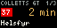
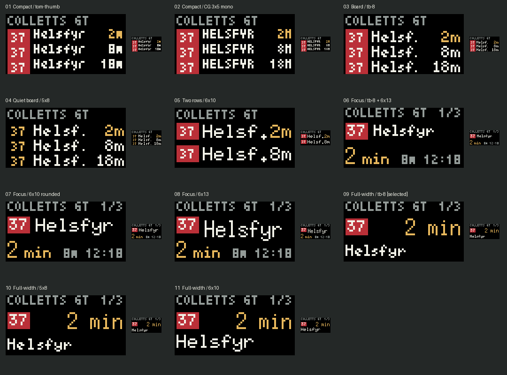
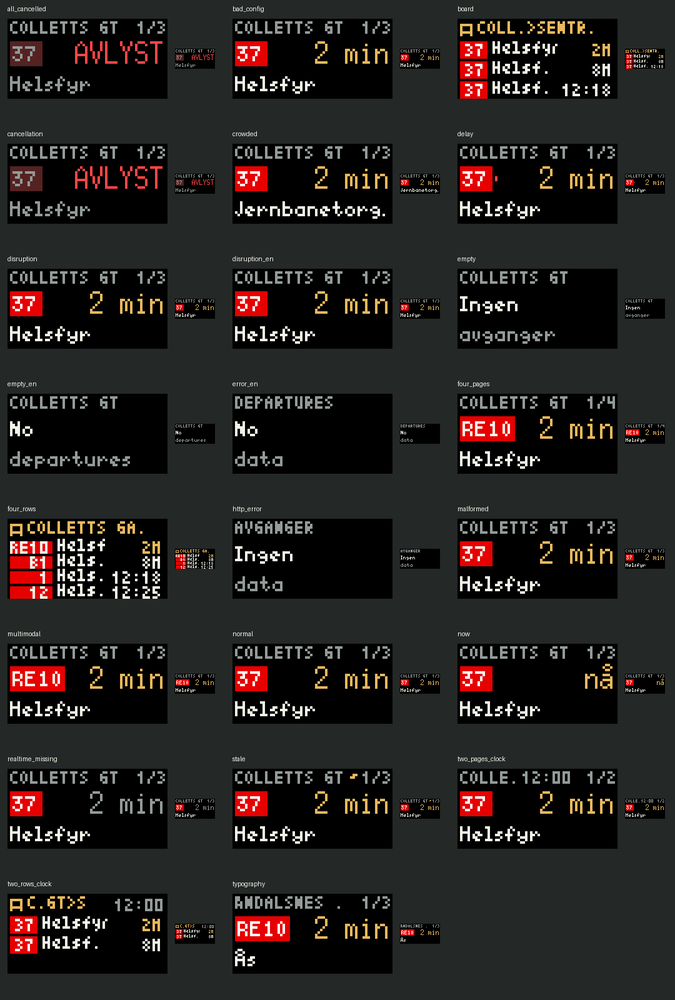

# Norway Departures

Live Entur departures for a 64x32 Tidbyt or Tronbyt display. Search stations
throughout Norway; all transport modes returned by Entur are included.
The default remains Colletts gate, Oslo, toward Sentrum.

## Living-room display



The default `layout=lounge` shows one departure per page. A full-width
destination sits below the route badge and a large, right-aligned countdown.
Station, page position, and status occupy a quiet secondary header.

- `6x13` countdown: 9-pixel capitals, compared with the old 4-pixel capitals.
- `tb-8` destinations and route badges: 6-pixel capitals, proportional spacing,
  and Norwegian accented letters. This gives names more room than `6x10`.
- `tom-thumb` station header; `CG-pixel-3x5-mono` page counter and optional clock.
  Small type is reserved for secondary information in the living-room layout.
- Soft white `#f2f2e8`, grey `#939b98`, restrained amber `#e8b85c`, black background.
  Entur route colours remain intact. No flashing, gradients, or glow.
- Normal pages hold still for 3.6 seconds. Total lounge animation is bounded
  to 14.4 seconds.
- Only the active destination scrolls, after a 1.8-second pause. Abbreviations
  and a final dot bound unusually long names to the available animation time.
  Service advisories are not displayed, either as pages or warning indicators.
- Amber time means leave now; grey means scheduled or uncertain real-time data.
  A red dot marks delays over two minutes. Cancelled services have a dim badge
  and red cancellation label. `~` marks stale data.

This prioritizes readable departures over seeing every departure simultaneously.
Choose **Display / visning > Departure board / tavle** for the compact 2-4-row
layout (`layout=board`). Its small fonts are better suited to close viewing.

## Design comparison



Eleven concepts were rendered using seven built-in fonts. The study preserves
rejected versions, including their crowding and clipping, for honest comparison.

| Concepts | Assessment |
| --- | --- |
| Compact: tom-thumb / CG 3x5 | Dense, but small letterforms for distant viewing |
| Three-row: tb-8 / 5x8 | Larger letters compete with the destination and time columns |
| Two-row: 6x10 | Better size, but still abbreviates even short destinations |
| Focus: tb-8 / rounded 6x10 / 6x13 | Good hierarchy; destination still competes with badge width |
| Full-width: tb-8 | Selected: clear hierarchy, longer names, generous black space |
| Full-width: 5x8 / 6x10 | Fixed advance consumes more horizontal space than tb-8 |

The selected design was then refined with measured text widths, one-pixel side
margins, a consistent 8/14/10-pixel vertical structure, bounded scrolling,
and explicit cancellation/error states. Actual panel brightness and viewing
distance still need checking on the physical device; browser pixels cannot
prove LED readability. Use device brightness settings for evening comfort.

## Preview and configuration

From the repository root:

```sh
pixlet serve apps/collettsbus/collettsbus.star --port 8080 --no-browser
pixlet render apps/collettsbus/collettsbus.star -o /tmp/departures.webp
pixlet render apps/collettsbus/collettsbus.star layout=board -o /tmp/board.webp
```

Preview: <http://localhost:8080>. The running server watches the app for edits.

| Setting | Default | Meaning |
| --- | --- | --- |
| `stop` | `NSR:StopPlace:6286` | Norway-wide station search, or a raw stop ID on the CLI |
| `quay` | `NSR:Quay:11544` | Platform; other stations default to `all` |
| `layout` | `lounge` | Large departure pages, or `board` |
| `rows` | `3` | 2-4 departure pages, or board rows |
| `walk_minutes` | `2` | Hide departures you cannot reach; 0-15 minutes |
| `lines` | empty | Comma-separated public codes or full Entur line IDs |
| `destination_filter` | empty | Case-insensitive destination substring |
| `lang` | `no` | Norwegian or `en` |
| `show_clock` | `false` | Small Oslo clock in the header |

On 2026-09-24, the live probe returned line 37 to **Helsfyr** from quay
`NSR:Quay:11544`, and line 37 to **Nydalen T** from `NSR:Quay:11545`.
The Helsfyr direction runs south through Sentrum. Entur returned empty platform
codes; platform labels 1 and 2 are fallback labels. The journey-planner Quay
type does not expose `compassBearing`. The Drammen stop is not used.

## Reproduce and verify

```sh
python3 -m venv .venv
.venv/bin/python -m pip install -r scripts/requirements.txt
.venv/bin/python scripts/probe_entur.py
.venv/bin/python -m unittest discover -s scripts -p 'test_*.py' -v
pixlet format --dry-run apps/collettsbus/collettsbus.star scripts/design_study.star
pixlet lint apps/collettsbus/collettsbus.star scripts/design_study.star
pixlet check apps/collettsbus
bash scripts/render_states.sh
.venv/bin/python scripts/render_designs.py
```

The design script regenerates all eleven studies and the contact sheets, then
checks every frame of every state for 64x32 dimensions, nonblank output,
black side margins, and animations no longer than 15 seconds.
The probe needs only requests; Pillow is used by the visual checks.



Verified locally with original Tidbyt Pixlet v0.34.0 and Homebrew Tronbyt Pixlet
v0.54.0. GitHub CI uses the original Tidbyt build for catalogue compatibility.
The Homebrew build's `devices` and `push`
commands target Tronbyt, not the original Tidbyt cloud. For an original Tidbyt,
use the upstream Tidbyt Pixlet CLI for authentication and upload:

```sh
pixlet devices
pixlet push YOUR_DEVICE_ID /tmp/departures.webp --installation-id norwaydepartures
```

## Public catalogue publication

The intended deployment is Tidbyt's public app catalogue. Once accepted and
deployed by Tidbyt, the Starlark app runs on Tidbyt's infrastructure; users do
not need an always-on computer, a personal server, or a device API key.

Publishing this source repository alone does not deploy the app. Follow the
[official publishing process](https://tidbyt.dev/docs/publish/publishing-apps):

1. Prepare a fork of `tidbyt/community`.
2. Add the app source, manifest, and preview assets under the appropriate app folder.
3. Validate with the original Tidbyt Pixlet and the community repository checks.
4. Submit a pull request with a description and rendered preview for review.
5. After acceptance and deployment, install through the Tidbyt mobile catalogue.

This is a new listing named **Norway Departures**, with app ID
`norway-departures`, sourced from
[jakobbbbbbb/ruter-tidbyt](https://github.com/jakobbbbbbb/ruter-tidbyt).
The existing Norway Transport listing and its installations are left unchanged.
The proposed submission folder is `apps/norwaydepartures`; the source stays in
`apps/collettsbus` locally so existing commands and the live preview keep working.
No matching folder was found in the community tree on 2026-09-24; final ID and
name availability remain subject to community review.

Submit only the Starlark app, manifest, and relevant preview/documentation assets,
not the Python helpers, test harness, local caches, credentials, or design studies.
An enlarged submission preview is available at `screenshots/catalogue-preview.gif`.

The Python render/upload helpers are optional local testing tools, not part of
the cloud app. The successful one-off hardware test pushed an image only and
did not install a continuously updating app or change the saved rotation.
The local safe-render helper uses Tronbyt Pixlet's `-c` JSON configuration flag;
it is not compatible with the original v0.34.0 CLI. Use original Pixlet directly
for publication checks. The Starlark logic tests accept a `PIXLET` executable
override and run offline in either runtime.

## Network limitations

One station-wide GraphQL request per render, with a 30-second HTTP cache and
`ET-Client-Name: jakobbbbbbb-tidbyt-colletts`. HTTP status failures and GraphQL errors
can use the last good snapshot for up to ten minutes in a persistent renderer.
Root expiry is 60 seconds. All departure calculations use Oslo-aware timestamps.

Pixlet v0.54.0 raises a fatal Starlark error on transport timeouts; Starlark has
no exception handling. Such failures cannot enter the app's cached-data branch.
The error fixture verifies the screen, not network-timeout recovery. The optional
`scripts/render_safe.py` helper catches local process failures and renders a
bounded on-disk snapshot; it is not executed by Tidbyt's community app host.
Hosted transport failures remain subject to the host's retry/error behavior.
Independent CLI runs need persistent cache configuration or the local helper
to share cached data.
